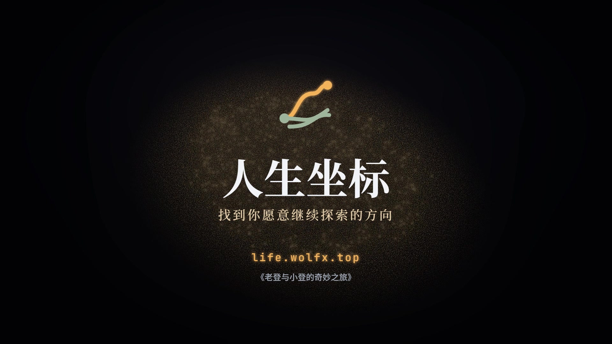
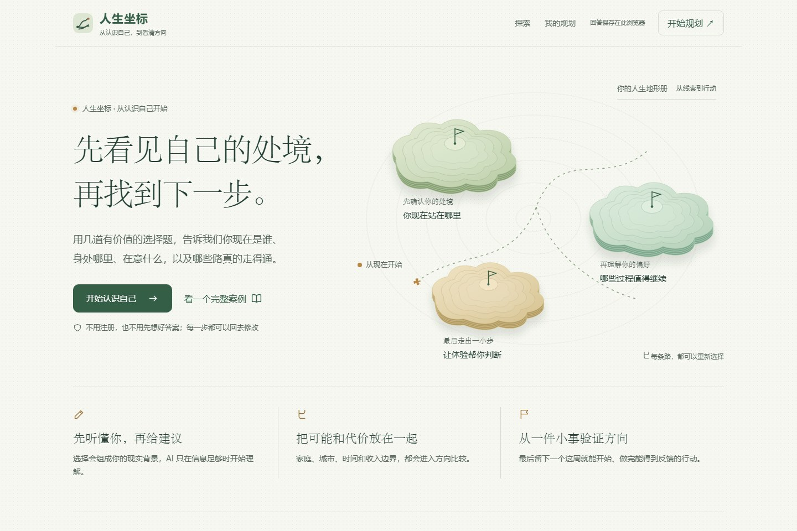
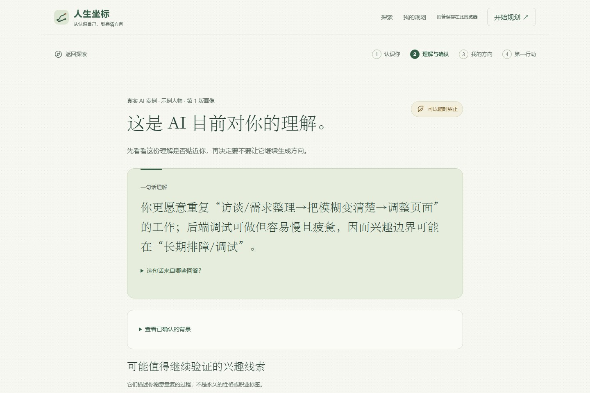
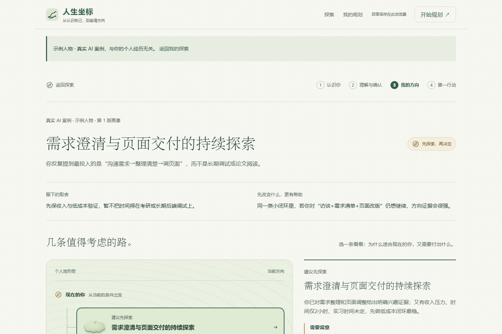
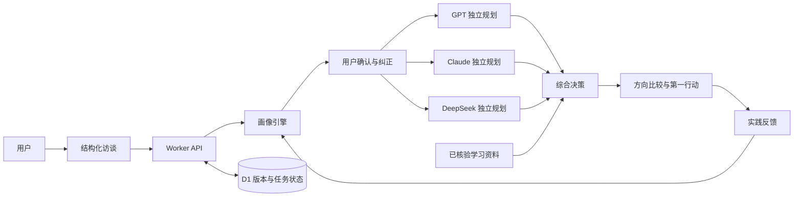
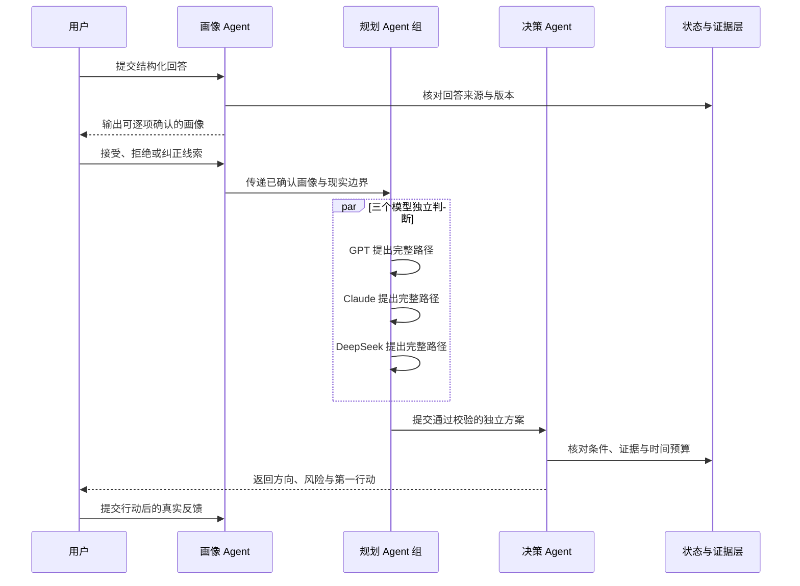

AI软件赛道 - 人生坐标 - 老登与小登的奇妙之旅

<p align="center">
  
</p>

<h1 align="center">人生坐标</h1>

<p align="center">不用一道测试定义你，而是从真实处境出发，找到一个可以验证的下一步。</p>

<p align="center">
  <a href="https://life.wolfx.top"><strong>立即体验</strong></a>
  ·
  <a href="#宣传片">宣传片</a>
  ·
  <a href="submission/README.md">参赛材料</a>
  ·
  <a href="#快速开始">本地运行</a>
  ·
  <a href="#系统架构">系统架构</a>
  ·
  <a href="#测试与可靠性">测试结果</a>
</p>

## 宣传片

[](https://github.com/wolfgang008/life-coordinate/releases/tag/promo-2026-10-04)

**[下载 1080p 正式成片](https://github.com/wolfgang008/life-coordinate/releases/download/promo-2026-10-04/life-coordinate-promo-final-1080p.mp4)** · [完整发布与附件](https://github.com/wolfgang008/life-coordinate/releases/tag/promo-2026-10-04) · [影片说明](docs/promotional-film.md)



## 参赛信息

| 项目 | 内容 |
| --- | --- |
| 赛道 | AI 软件赛道 |
| 项目名称 | 人生坐标 |
| 队伍名称 | 老登与小登的奇妙之旅 |
| 队长 | 房刚毅 |
| 队员 | 李喜军 |
| 在线 Demo | [https://life.wolfx.top](https://life.wolfx.top) |
| 提交材料 | [参赛材料总览](submission/README.md) |

## 项目简介

人生坐标面向高中毕业到大学毕业初期的年轻人，解决「了解不少方向，却不知道哪一条真的适合当下的自己」这个问题。

传统职业测评往往停在性格标签和职业名称，真正的选择却还受学业基础、家庭支持、所在城市、收入压力和可投入时间影响。本项目把这些现实条件纳入同一次分析，先让用户确认 AI 的理解，再比较方向，最后用一件小事收集真实反馈。

| 项目 | 说明 |
| --- | --- |
| 行业与场景 | 教育与生涯规划，聚焦升学、专业探索和毕业去向决策 |
| 核心用户 | 高中毕业生、大学生与毕业初期用户 |
| 核心价值 | 把「建议」变成可纠正、可追溯、可执行、可复评的探索闭环 |
| 当前形态 | 可运行 Web MVP，含真实 AI 画像、多模型方向规划与行动反馈 |

## 产品闭环

1. **确认处境**：用结构化选择题了解阶段、学习、实践、家庭、地域、收入与时间边界，文字经历仅作可选补充。
2. **形成画像**：AI 把回答整理为事实、兴趣假设、能力线索、现实边界和关键未知。
3. **用户确认**：每条兴趣线索都可接受、拒绝或纠正；没有经用户确认的推测，不会直接限制后续建议。
4. **独立规划**：三个模型基于同一份已确认画像分别提出完整路径，避免第一个结论影响后续判断。
5. **综合决策**：决策模型在可行性、时间、风险和个人证据之间做取舍，输出主推方向、保留可能与条件路线。
6. **行动验证**：给出一个当周可完成的小任务，记录「想继续的部分」「卡住的地方」与「是否愿意再做一次」，再更新下一版建议。

<table>
  <tr>
    <td width="50%"></td>
    <td width="50%"></td>
  </tr>
  <tr>
    <td align="center"><sub>画像先确认，不把模型推测当成用户事实</sub></td>
    <td align="center"><sub>方向、代价、条件和第一行动放在同一个决策界面</sub></td>
  </tr>
</table>

## 核心功能与代码位置

| 功能 | 已实现内容 | 主要文件 |
| --- | --- | --- |
| 分阶段访谈 | 五个人生阶段、动态追问、选项有效性与回答迁移 | `public/domain/stages.js` `public/views/interview.js` |
| 个人画像 | 事实与假设分离、来源追溯、兴趣确认、边界核对和动态追问 | `src/profiling/engine.mjs` `public/views/profile.js` |
| 多模型规划 | 三个独立规划模型并行分析，至少两份有效结果才进入综合 | `src/ai.mjs` `src/profiling/api.mjs` |
| 个人地形册 | 主推、备选与条件路线比较，支持单条件变化预览 | `public/views/result.js` `public/domain/contracts.js` |
| 第一行动 | 将抽象方向拆成可完成、可检查、可复盘的小任务 | `public/views/action.js` |
| 版本与会话安全 | 匿名会话隔离、乐观锁、请求去重、过期清理与迟到结果保护 | `src/db.mjs` `src/worker.mjs` `migrations/` |

## 系统架构



前端使用原生 HTML、CSS 和 ES Modules，无前端框架运行时。后端由 Worker 提供静态资源、API、NDJSON 进度流和 D1 数据访问。模型输出在进入业务流程前必须通过结构、来源、时间预算与现实边界校验。

## Agent 工作流



## 大模型使用说明

所有模型请求都由后端发起，前端不持有密钥。系统通过 OpenAI 兼容的 `POST /v1/chat/completions` 接口调用模型，关闭自动跳转，并对请求时间、响应体积和 JSON 结构设置上限。

| 阶段 | 主模型 | 职责 |
| --- | --- | --- |
| 个人画像 | `gpt-5.4-mini` | 整理事实、兴趣假设、能力线索、边界与关键未知 |
| 独立规划 A | `gpt-5.4-mini` | 基于已确认画像提出完整路径；失败时使用 `gpt-5.4-nano` |
| 独立规划 B | `claude-sonnet-4-6` | 从另一模型视角独立评估可行性与风险 |
| 独立规划 C | `deepseek-v4-flash` | 提供第三份独立方案；失败时使用 `deepseek-v4-pro` |
| 综合决策 | `gpt-5.4` | 比较独立方案并形成最终方向；支持 DeepSeek 与 GPT 备用序列 |

这不是把多个模型的简短意见拼接在一起。每个独立模型必须先产出包含理由、风险、条件和行动的完整方案；有效方案少于两份时，系统会明确终止，不会用本地规则伪造 AI 结果。

## 商业场景与验证计划

当前 MVP 先验证个人用户是否愿意完成「访谈—确认—行动—反馈」闭环。在机构端，学校生涯教育与就业指导部门、升学规划服务团队可作为潜在使用方，但付费方式和价格仍需通过试点验证，本项目不虚构收入数据。

下一阶段会重点记录三类可量化结果：首次背景整理所需时间、用户完成第一行动的比例，以及行动反馈后继续使用的比例。这些数据将用来判断它是否能降低一对一初访的重复工作，并提高规划后的实际行动率。

## 快速开始

### 环境要求

- Node.js 22.13 或更高版本
- npm
- 运行真实 AI 分析时，需要可用的 OpenAI 兼容 API 密钥

### 安装与运行

```powershell
npm install
npm run db:local
npm run dev
```

打开 `http://127.0.0.1:8788`。不配置模型密钥也可浏览首页和「完整案例」，案例会明确标记为示例人物。

需要运行真实分析时，在项目根目录创建不纳入 Git 的 `.dev.vars`：

```dotenv
API_BASE="https://your-openai-compatible-endpoint.example/v1"
API_KEY="your-private-api-key"
```

密钥只会由后端使用。`.dev.vars`、`.local/`、`.wrangler/` 和本地数据库均已被忽略。

## 测试与可靠性

```powershell
npm test
npm run build
```

当前回归测试为 **56 / 56 通过**，GitHub Actions 会在推送和拉取请求中执行全新依赖安装、测试与构建。

测试覆盖：

- 五个人生阶段、动态题与无文字经历场景；
- 画像、追问、方向、情景预览和行动数据协议；
- 地域、收入、实习、家庭责任和时间预算等硬边界；
- 多模型超时、结构修正、备用模型与部分失败降级；
- D1 会话隔离、请求锁、重复请求、过期清理与云端写入失败；
- 旧版本数据迁移、多标签页冲突和超量本地缓存。

测试不调用真实用户数据，也不会把规则预览冒充为真实 AI 分析。

## 数据与隐私

- 回答、规划和行动笔记默认保存在用户浏览器。
- 只有在用户明确同意后，当次资料才会发往模型服务。
- 页面会提醒用户不要填写姓名、联系方式、详细住址和资产信息。
- 服务端状态用于保持版本一致、隔离匿名会话并防止重复请求，过期数据由定时任务清理。

## 项目结构

```text
.
├── public/                 前端页面、视图、样式、领域规则与示例内容
├── src/                    Worker 入口、数据访问、画像引擎与多模型编排
├── migrations/             D1 数据库迁移
├── content/                可纳入规划的学习资料包
├── scripts/                构建、测试、预览、截图与验收工具
├── docs/screenshots/       README 使用的真实产品截图
├── qa/                     验收记录与可重现检查结果
├── .github/workflows/      持续集成配置
├── package.json            项目命令与依赖
└── wrangler.toml           Worker、模型与 D1 运行配置
```

## 团队与分工

- **队伍名称：**老登与小登的奇妙之旅
- **队长：**房刚毅
- **队员：**李喜军
- **仓库维护：**[@wolfgang008](https://github.com/wolfgang008)

仓库不公开个人联系方式。参赛材料中的成员信息以本页和正式报名信息为准。

---

<p align="center"><sub>方向不是一次算出来的。它是在一次次真实体验中慢慢变清楚的。</sub></p>
