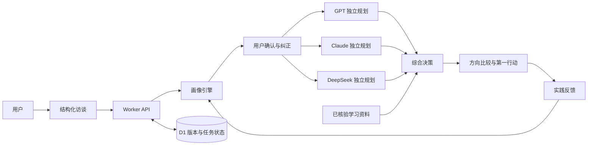

# 系统架构、工作流程与测试结果

## 系统架构



前端使用原生 HTML、CSS 和 ES Modules。Cloudflare Worker 提供静态资源、API、NDJSON 进度流与 D1 数据访问。模型调用均由后端发起，前端不持有 API 密钥。

## 工作流程

1. 用户按当前人生阶段完成结构化访谈。
2. 画像 Agent 将回答整理为事实、兴趣假设、能力线索、现实边界和关键未知。
3. 用户逐项接受、拒绝或纠正画像，未经确认的推测不会直接限制后续建议。
4. GPT、Claude 与 DeepSeek 基于同一份已确认画像分别提出完整规划。
5. 决策 Agent 比较有效方案，结合证据、风险、时间预算和现实条件形成个人地形册。
6. 系统给出当周可完成的第一行动，并根据实践反馈更新下一版建议。

## 关键测试用例

| 类别 | 测试内容 | 预期结果 |
| --- | --- | --- |
| 阶段与访谈 | 五个人生阶段、动态题、无文字经历 | 问题与选项适配阶段，回答可安全迁移 |
| 画像协议 | 事实与假设、来源追溯、兴趣确认 | 推测与事实分离，用户可纠正 |
| 现实边界 | 地域、收入、实习、家庭责任、时间预算 | 规划结果保留硬约束，不输出不可行路径 |
| 多模型编排 | 超时、结构修正、备用模型、部分失败 | 至少两份有效独立结果才进入综合决策 |
| 会话与并发 | 会话隔离、请求锁、重复请求、过期清理 | 不串号、不重复执行、不接受迟到结果 |
| 数据兼容 | 旧版本迁移、多标签页冲突、超量缓存 | 保留可迁移数据并给出明确冲突处理 |

## 测试结果

- 自动回归测试：56 / 56 通过
- 构建检查：通过
- GitHub Actions：推送和拉取请求时执行依赖安装、测试与构建
- 测试不调用真实用户数据，也不会把规则预览冒充为真实 AI 分析

复现命令：

```powershell
npm install
npm test
npm run build
```

更详细的模块说明、运行方式和隐私设计见[项目 README](../../README.md)。

## 演示视频事实来源

演示视频开场提到“2026 届高校毕业生预计 1270 万人”。该数据来自教育部 2026 年 6 月发布的信息：[2026 届全国普通高校毕业生规模预计 1270 万人](https://hudong.moe.gov.cn/jyb_xwfb/s5147/202606/t20260615_1440719.html)。视频中的人物与路径内容为产品功能演示案例，不代表对所有毕业生的统计结论。
